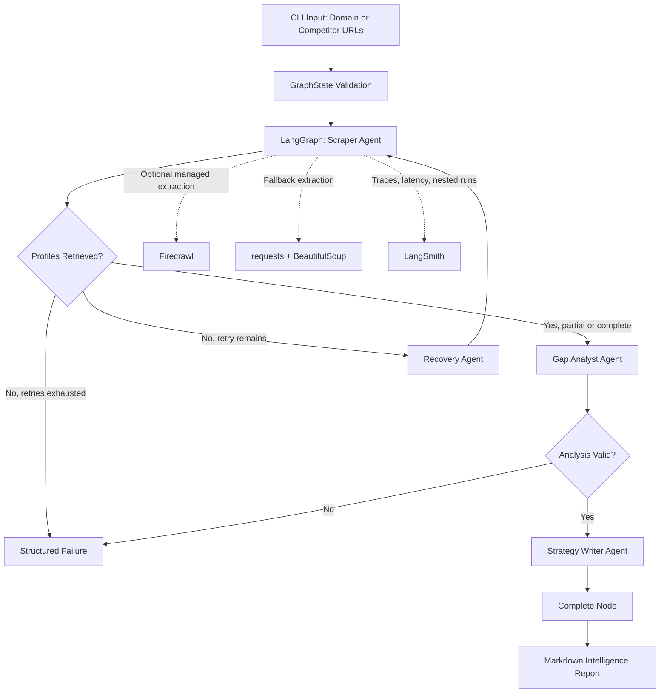

# CompetitivePulse

> **Autonomous Multi-Agent Competitive Intelligence & Lead Enrichment Engine**  
> Built with LangGraph, Pydantic v2, Firecrawl fallback extraction, and LangSmith observability.

<!--
Technical screener demo placement:

1. Record a 60-120 second Loom demonstrating:
   - CLI execution
   - LangSmith trace navigation
   - Failure recovery loop
   - Generated Markdown report
2. Upload a short GIF to docs/demo.gif or use an externally hosted GIF.
3. Replace the line below with one of the following:

[](https://www.loom.com/share/YOUR_LOOM_ID)


-->

CompetitivePulse is a production-oriented Python application that transforms public competitor URLs into a structured intelligence report. It orchestrates scraping, extraction, feature and price analysis, market-gap discovery, and strategy generation through a stateful LangGraph workflow.

The project is designed to demonstrate practical AI systems engineering: validated state contracts, resilient web extraction, cyclic recovery behavior, structured failures, traceable execution, and an interface that can run in a local terminal or CI environment.

## Why it matters

Competitive research often breaks down because the work is manual, unstructured, stale, difficult to audit, and disconnected from product or go-to-market action. CompetitivePulse addresses that workflow by:

- Collecting publicly available competitor product and pricing signals.
- Enforcing strict Pydantic v2 schemas at every major pipeline boundary.
- Recovering from complete scrape failures through a bounded LangGraph retry loop.
- Preserving partial research results rather than discarding useful competitor profiles.
- Converting raw extraction into positioning, market-gap, and strategic recommendation artifacts.
- Emitting traceable runs through LangSmith when telemetry environment variables are configured.

## Architecture



## Engineering features

### Stateful multi-agent execution

The LangGraph `GraphState` model carries validated inputs, extracted profiles, analysis output, strategy recommendations, retry counts, timestamps, and structured errors across every node.

The workflow contains these distinct agents:

| Agent | Responsibility | Output |
|---|---|---|
| Scraper Agent | Fetches public URLs using Firecrawl when configured; otherwise uses a hardened HTTP fallback. | `CompetitorProfile` records |
| Recovery Agent | Handles bounded retries after complete scrape failures. | Updated retry state |
| Gap Analyst Agent | Detects recurring features, unique signals, public pricing visibility, and market opportunities. | `CompetitiveAnalysis` |
| Strategy Writer Agent | Converts analysis into buyer-facing positioning and prioritized actions. | `StrategyReport` |

### Self-correction and error recovery

CompetitivePulse treats web access as unreliable by design.

- `requests` uses retry-aware HTTP adapters for transient errors including 408, 429, 500, 502, 503, and 504 responses.
- A Firecrawl failure transparently falls back to direct HTTP extraction.
- Block signals such as CAPTCHA, Cloudflare, access denial, and unusual traffic are surfaced as structured `PipelineError` records.
- A complete scrape failure enters the LangGraph recovery loop until `max_retries` is reached.
- Partial success proceeds to analysis so usable competitive intelligence is never silently discarded.
- Schema errors and non-recoverable analysis failures are preserved and reported clearly.

### Strict typed contracts

All important entities use Pydantic v2 models with:

- `extra="forbid"` to reject unexpected state.
- Validation on assignment.
- URL normalization and de-duplication.
- Strict bounds for confidence scores, collection lengths, and text content.
- Explicit error categories: validation, network, access, extraction, analysis, reporting, and unknown.

### Production observability

CompetitivePulse supports LangSmith through standard environment variables. When enabled, LangGraph/LangChain-compatible runs appear in LangSmith with nested workflow execution, node timing, errors, metadata, tags, and compatible LLM token information.

The CLI configures:

- `LANGCHAIN_TRACING_V2=true`
- `LANGCHAIN_API_KEY`
- `LANGCHAIN_PROJECT=competitivepulse`
- `LANGCHAIN_ENDPOINT=https://api.smith.langchain.com`

The runtime also writes application logs to:

```text
logs/competitivepulse.log
```

## Installation

### Prerequisites

- Python 3.11 or newer.
- `pip` or another Python package manager.
- Public competitor URLs to analyze.
- Optional Firecrawl API key.
- Optional LangSmith API key for observability.

### Create and activate a virtual environment

macOS or Linux:

```bash
python3.11 -m venv .venv
source .venv/bin/activate
```

Windows PowerShell:

```powershell
py -3.11 -m venv .venv
.venv\Scripts\Activate.ps1
```

### Install dependencies

```bash
pip install --upgrade pip
pip install -r requirements.txt
```

### Configure environment variables

Copy the example configuration:

```bash
cp .env.example .env
```

On Windows PowerShell:

```powershell
Copy-Item .env.example .env
```

Then edit `.env`.

#### Minimal local configuration

No credentials are required for the fallback scraper. Leave `FIRECRAWL_API_KEY` and LangSmith variables blank if you want an entirely local run.

```dotenv
COMPETITIVE_PULSE_LOG_LEVEL=INFO
COMPETITIVE_PULSE_MAX_RETRIES=3
```

#### Firecrawl extraction

Set the following value if you have a Firecrawl API key:

```dotenv
FIRECRAWL_API_KEY=your_firecrawl_api_key
```

Firecrawl is attempted first and is especially useful for pages that require improved main-content extraction. If the Firecrawl call fails, CompetitivePulse continues using the fallback HTTP extractor.

#### LangSmith telemetry

Place LangSmith configuration in the project-root `.env` file:

```dotenv
LANGCHAIN_TRACING_V2=true
LANGCHAIN_API_KEY=your_langsmith_api_key
LANGCHAIN_PROJECT=competitivepulse
LANGCHAIN_ENDPOINT=[https://api.smith.langchain.com](https://api.smith.langchain.com)
COMPETITIVE_PULSE_ENVIRONMENT=development
```

After executing a run, open your configured LangSmith project to inspect nested graph activity, runtime metadata, timing, and errors.

## Quick start

Analyze a single competitor:

```bash
python main.py --domain [https://example.com](https://example.com) --print-report
```

Analyze multiple competitors:

```bash
python main.py \
  --target-domain yourcompany.com \
  --competitor [https://competitor-one.example](https://competitor-one.example) \
  --competitor [https://competitor-two.example](https://competitor-two.example) \
  --competitor [https://competitor-three.example](https://competitor-three.example) \
  --output reports/market-intelligence.md \
  --print-report
```

Run the built-in sample competitor list:

```bash
python main.py --print-report
```

The CLI prints the report path and creates a timestamped Markdown report in:

```text
reports/
```

## CLI reference

```text
usage: CompetitivePulse [-h] [--domain DOMAIN | --competitor COMPETITORS]
                        [--target-domain TARGET_DOMAIN] [--output OUTPUT]
                        [--max-retries MAX_RETRIES] [--print-report]
```

| Argument | Description |
|---|---|
| `--domain` | A single target competitor domain or full URL. |
| `--competitor` | Repeatable competitor URL argument for multi-company analysis. |
| `--target-domain` | Optional domain for the company conducting the comparison. |
| `--output` | Optional path for the generated Markdown report. |
| `--max-retries` | Overrides the configured complete-scrape retry limit. |
| `--print-report` | Prints the generated report in the terminal after writing it. |

## Example output

CompetitivePulse reports contain:

- Executive summary.
- Recommended positioning.
- Per-competitor extraction metadata, pricing signals, features, and differentiator signals.
- Recurring market features.
- Pricing visibility observations.
- Prioritized market gaps with confidence indicators.
- A sequenced strategic recommendation set.
- A risk watchlist explaining extraction and validation limitations.

## Responsible operation

This project is designed for legitimate public competitive research.

- Use only publicly accessible URLs you are permitted to access.
- Comply with website terms of service, robots policies, applicable contracts, rate limits, and privacy law.
- Do not use the application to bypass CAPTCHAs, authentication, anti-bot protections, or access controls.
- Verify material pricing, feature, and competitive claims with authoritative sources before distributing them externally.
- Treat automated extraction as research assistance, not legal, commercial, or factual proof.

## Development quality

Run syntax validation:

```bash
python -m compileall .
```

Run a local end-to-end execution against a permitted public URL:

```bash
python main.py --domain [https://example.com](https://example.com) --output reports/example.md --print-report
```

Expected operational behavior:

1. The CLI validates inputs using Pydantic.
2. LangGraph initializes graph state.
3. The scraper attempts Firecrawl if a key exists.
4. The scraper uses `requests` and BeautifulSoup when Firecrawl is unavailable or fails.
5. Extraction failures are recorded as typed errors.
6. A full failure enters a bounded recovery loop.
7. Successfully retrieved profiles flow to the analyst and writer nodes.
8. The Markdown report is persisted locally.
9. LangSmith receives traces when environment configuration is present.

## Scaling roadmap

### Data and persistence

- Add PostgreSQL for durable competitor snapshots, source hashes, and longitudinal change history.
- Store reports and raw source artifacts in S3-compatible object storage.
- Add SQLModel or SQLAlchemy repositories with Alembic migrations.
- Track feature and price changes using content diffs and normalized entity versions.

### Queueing and scheduling

- Deploy periodic scans through Celery, Temporal, Prefect, or cloud-native queues.
- Use per-domain rate limiting and exponential backoff policies.
- Add scheduled jobs for daily, weekly, or launch-event monitoring.
- Route high-confidence changes into Slack, email, CRM, or product intelligence workflows.

### AI enrichment

- Add a model-backed extraction stage with provider-agnostic structured output.
- Use LangSmith datasets and evaluators to measure extraction accuracy and report usefulness.
- Add claim-evidence linking so every material recommendation includes exact supporting excerpts.
- Introduce human review queues for low-confidence or high-impact conclusions.

### Enterprise hardening

- Add authentication and multi-tenant authorization.
- Enforce outbound allowlists and SSRF protections.
- Add secrets management through AWS Secrets Manager, HashiCorp Vault, or cloud identity providers.
- Create audit logs, retention controls, and data classification.
- Add OpenTelemetry export alongside LangSmith for enterprise observability systems.
- Containerize with a non-root image, health checks, dependency scanning, and CI quality gates.

## Suggested recruiter demo

For a strong technical screening artifact:

1. Add a Loom or GIF at the top of this README using the commented template.
2. Show the CLI processing two or three permitted public URLs.
3. Open LangSmith and show the nested LangGraph traces.
4. Demonstrate a blocked or invalid URL producing structured error handling.
5. Show the generated Markdown report.
6. Explain the bounded recovery loop and why partial results continue into analysis.
7. Discuss the production scaling roadmap: persistence, scheduling, evaluation, governance, and secure deployment.

## License

Choose an explicit license before publishing publicly. Apache-2.0 is commonly appropriate for business-friendly open-source projects; AGPL-3.0 may be appropriate when you want hosted modifications to remain open source.
